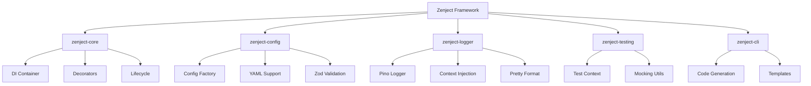

# 🚀 Zenject Framework - Complete Guide

[](https://bun.sh)
[](https://github.com/maltyxx/zenject/blob/main/LICENSE)

## 📋 Table of Contents
1. [What is Zenject?](#what-is-zenject-)
2. [Framework Architecture](#framework-architecture)
3. [Core Packages](#core-packages)
4. [Utility Packages](#utility-packages)
5. [Fundamental Concepts](#fundamental-concepts)
6. [Usage Examples](#usage-examples)
7. [Comparison with Other Frameworks](#comparison-with-other-frameworks)

---

## What is Zenject?

**Zenject** is a lightweight, modern **Dependency Injection (DI)** framework optimized for **BunJS**, specifically designed for this project. It's inspired by Angular's DI system while being simpler and adapted to modern TypeScript applications.

### 🎯 Framework Goals

- **Simplicity**: Intuitive API with familiar decorators
- **Performance**: Optimized for BunJS with lazy loading
- **Type Safety**: 100% TypeScript with integrated Zod validation
- **Modularity**: Reusable module-based architecture
- **Testability**: Built-in testing utilities

### 🌟 Key Benefits

- ✅ **Zero Configuration**: Works directly without complex setup
- ✅ **Native TypeScript**: No compilation needed with BunJS
- ✅ **Lightweight**: Uses TSyringe as underlying DI engine
- ✅ **Advanced Configuration**: YAML support + Zod validation
- ✅ **Automatic Discovery**: Automatic detection of decorated classes

---

## Framework Architecture



---

## Core Packages

### 📦 `@zenject/core` - Framework Core

**Responsibility**: Provides essential dependency injection functionalities.

#### Main Features

- **DI Container**: Centralized container based on TSyringe
- **Decorators**: `@Module`, `@Injectable`, `@Inject`
- **Lifecycle**: Component lifecycle management
- **Lazy Loading**: Lazy module loading

#### Main API

```typescript
import { Zenject, Module, Injectable } from '@zenject/core';

// 1. Main application class
const app = new Zenject(AppModule);
await app.bootstrap();

// 2. Dependency resolution
const service = app.resolve(MyService);

// 3. Decorators
@Injectable()
export class MyService {}

@Module({
  imports: [OtherModule],
  providers: [MyService],
  exports: [MyService]
})
export class AppModule {}
```

#### Internal Structure

- `container.ts`: Centralized DI container
- `zenject.ts`: Main framework class
- `decorators/`: All decorators (@Module, @Injectable, etc.)
- `lifecycle/`: Lifecycle management
- `types/`: Framework TypeScript types

---

### 📦 `@zenject/config` - Advanced Configuration System

**Responsibility**: Configuration management with validation and environment overrides.

#### Main Features

- **Factory Pattern**: `createConfig()` to create configurations
- **Zod Validation**: Automatic type-safe validation
- **YAML Support**: Loading from YAML files
- **Environment Overrides**: Override with environment variables

#### Usage Pattern

```typescript
import { createConfig } from '@zenject/config';
import { z } from 'zod';

// 1. Schema definition
export const AppConfig = createConfig('app', {
  schema: z.object({
    name: z.string().default('MyApp'),
    port: z.number().default(3000),
    environment: z.enum(['development', 'production']).default('development'),
    features: z.array(z.string()).default([]),
    debug: z.boolean().default(false)
  }),
  description: 'Application configuration',
  envOverrides: {
    port: 'PORT',
    environment: 'NODE_ENV',
    debug: 'DEBUG'
  }
});

// 2. Injection in a service
@Injectable()
export class AppService {
  constructor(@Inject(AppConfig.KEY) private config: AppConfigType) {}
}

// 3. Module configuration
@Module({
  imports: [
    ConfigModule.forRoot({
      enableEnvOverrides: true,
      filePath: 'config/settings.yaml',
      load: [AppConfig]
    })
  ]
})
export class AppModule {}
```

#### Pattern Benefits

- ✅ **Type Safety**: TypeScript automatically infers types
- ✅ **Validation**: Fast failure if invalid configuration
- ✅ **Flexibility**: YAML support + environment variables
- ✅ **Documentation**: Self-documented schema with Zod

---

## Utility Packages

### 📦 `@zenject/discovery` - Automatic Discovery *(Future Package)*

**Note**: *This package is planned for future development and is not currently available in the framework.*

**Planned Responsibility**: Detection and automatic registration of decorated classes.

#### Planned Use Cases

Perfect for architectures where you have many classes (handlers, processors, validators) to discover dynamically.

#### Planned Features

- **Global Registry**: Automatic class registration
- **Advanced Filtering**: Search by type, tags, category
- **Metadata**: Method annotation with metadata

#### Planned Usage Pattern

```typescript
// Future API design - not currently implemented
import { Discoverable, DiscoveryService } from '@zenject/discovery';

// 1. Decorate classes
@Discoverable({
  type: 'processor',
  name: 'data-processor',
  category: 'processing',
  tags: ['data', 'transform']
})
export class DataProcessor {}

@Discoverable({
  type: 'validator',
  name: 'email-validator',
  category: 'validation',
  tags: ['email', 'format']
})
export class EmailValidator {}

// 2. Use discovery service
@Injectable()
export class ProcessingService {
  constructor(private discovery: DiscoveryService) {}

  async discoverProcessors() {
    const processors = await this.discovery.getByType('processor');
    const validators = await this.discovery.find({ 
      type: 'validator',
      category: 'validation'
    });
    // ... discovery logic
  }
}
```

#### Planned Benefits

- ✅ **Zero Config**: Automatic discovery
- ✅ **Flexible**: Tag and category system
- ✅ **Performant**: In-memory registry
- ✅ **Type Safe**: Full TypeScript support

---

### 📦 `@zenject/logger` - Contextual Logging System

**Responsibility**: Pino logger injection with automatic context.

#### Features

- **Context Injection**: Logger automatically contextualized with class name
- **Pino Integration**: Uses Pino for performance
- **Configuration**: Pretty-print support for development

#### Simple Usage

```typescript
import { InjectLogger } from '@zenject/logger';
import type { Logger } from '@zenject/logger';

@Injectable()
export class DataService {
  @InjectLogger() private readonly logger!: Logger;

  async processData(data: ProcessingData) {
    // Logger automatically prefixed with "DataService"
    this.logger.info('Processing data', { dataId: data.id });
    
    try {
      const result = await this.dataRepository.save(data);
      this.logger.info('Data processed successfully', { resultId: result.id });
      return result;
    } catch (error) {
      this.logger.error('Failed to process data', { error, data });
      throw error;
    }
  }
}
```

#### Module Configuration

```typescript
@Module({
  imports: [
    LoggerModule, // Auto-configuration with Pino
  ]
})
export class AppModule {}
```

---

### 📦 `@zenject/testing` - Testing Utilities

**Responsibility**: Facilitates test writing with the Zenject framework.

#### Features

- **Test Context**: Isolated context for each test
- **Mocking**: Support for mocks and stubs
- **Module Testing**: Test modules in isolation

#### Test Pattern

```typescript
import { createTestContext } from '@zenject/testing';

describe('DataService', () => {
  let testContext: TestContext;
  let dataService: DataService;

  beforeEach(async () => {
    testContext = await createTestContext({
      modules: [DataModule],
      mocks: [
        { provide: DataRepository, useValue: mockDataRepository }
      ]
    });
    
    dataService = testContext.resolve(DataService);
  });

  afterEach(async () => {
    await testContext.cleanup();
  });

  it('should process data', async () => {
    const inputData = { id: '123', content: 'test data' };
    const result = await dataService.processData(inputData);
    
    expect(result.content).toBe('test data');
    expect(mockDataRepository.save).toHaveBeenCalledWith(inputData);
  });
});
```

---

### 📦 `@zenject/cli` - Code Generator

**Responsibility**: CLI for generating framework-compliant code scaffolding.

#### Available Commands

```bash
# Generate a new module
zenject new:module data
# → Creates data/data.module.ts + index.ts

# Generate a new service  
zenject new:service notification
# → Creates notification/notification.service.ts + notification.service.test.ts + index.ts

# Generate a new application
zenject new:app worker --path apps
# → Creates apps/worker/ with complete structure
```

#### Generated Templates

- **Modules**: @Module structure with imports/providers
- **Services**: @Injectable class with injected logger
- **Tests**: Bun tests with TestContext
- **Applications**: Entry point with Zenject bootstrap

#### Workspace Configuration

The CLI automatically updates `package.json` workspaces when generating packages.

---

## Fundamental Concepts

### 🏗️ Modular Architecture

Zenject organizes the application into **modules** that encapsulate business logic:

```typescript
@Module({
  imports: [CommonModule, ConfigModule],    // Imported modules
  providers: [DataService, NotificationService],   // Provided services
  exports: [DataService]                   // Exposed services
})
export class DataModule {}
```

### 🔄 Lifecycle

1. **Bootstrap**: `app.bootstrap()` initializes the application
2. **Module Loading**: Lazy loading of modules
3. **Dependency Resolution**: Dependency resolution
4. **Lifecycle Hooks**: Execution of OnInit/OnDestroy hooks

### 🎯 Dependency Injection

Three supported injection patterns:

```typescript
// 1. Constructor Injection (recommended)
@Injectable()
export class DataService {
  constructor(
    private dataRepository: DataRepository,
    @Inject(AppConfig.KEY) private config: AppConfigType
  ) {}
}

// 2. Property Injection
@Injectable()
export class DataService {
  @InjectLogger() private logger!: Logger;
}

// 3. Token-based Injection
const DATA_REPOSITORY = new InjectionToken<DataRepository>('DataRepository');
```

---

## Usage Examples

### 🚀 Basic Application

```typescript
// main.ts
import { Zenject } from '@zenject/core';
import { AppModule } from './app.module';

const app = new Zenject(AppModule);
app.bootstrap(async () => {
  const appService = app.resolve(AppService);
  await appService.start();
});

// app.module.ts
@Module({
  imports: [
    ConfigModule.forRoot({
      filePath: 'config/app.yaml',
      load: [AppConfig]
    }),
    LoggerModule,
  ],
  providers: [AppService]
})
export class AppModule {}

// app.service.ts
@Injectable()
export class AppService {
  @InjectLogger() private logger!: Logger;
  
  constructor(
    @Inject(AppConfig.KEY) private config: AppConfigType
  ) {}

  async start() {
    this.logger.info('Application starting', { 
      version: this.config.version 
    });
    // Startup logic...
  }
}
```

### 🔍 Manual Service Registration

```typescript
// Define event handlers
@Injectable()
export class DataProcessedHandler {
  handle(event: DataProcessedEvent) {
    // Processing logic
  }
}

@Injectable()
export class NotificationSentHandler {
  handle(event: NotificationSentEvent) {
    // Processing logic
  }
}

// Orchestrator service with manual registration
@Injectable()
export class EventOrchestrator {
  private handlers = new Map();

  constructor(
    private dataProcessedHandler: DataProcessedHandler,
    private notificationSentHandler: NotificationSentHandler
  ) {}

  async onInit() {
    // Manual registration of handlers
    this.handlers.set('data-processed', this.dataProcessedHandler);
    this.handlers.set('notification-sent', this.notificationSentHandler);
  }

  async processEvent(eventName: string, payload: any) {
    const handler = this.handlers.get(eventName);
    if (handler) {
      await handler.handle(payload);
    }
  }
}
```

---

## Comparison with Other Frameworks

| Feature | Zenject | NestJS | InversifyJS |
|---------|---------|---------|-------------|
| **Runtime** | BunJS Native | Node.js | Node.js/Browser |
| **Compilation** | ❌ None | ✅ Required | ❌ Optional |
| **Configuration** | YAML + Zod | JSON/TS | JSON/TS |
| **Discovery** | 🔄 Planned | ❌ Manual | ❌ Manual |
| **Testing** | ✅ Utils included | ✅ Utils included | ❌ External |
| **CLI** | ✅ Built-in | ✅ Complete | ❌ None |
| **Learning Curve** | 🟢 Low | 🟡 Medium | 🔴 High |

### 🎯 When to Use Zenject?

**✅ Perfect for:**
- Modern BunJS/TypeScript applications
- Microservices with YAML configuration
- Event-driven architectures
- Teams preferring simplicity over complexity

**❌ Less suitable for:**
- Legacy Node.js applications
- Projects requiring the complete NestJS ecosystem
- Frontend applications (use Angular/React DI)

---

## 🚀 Going Further

### Useful Scripts

```bash
# Development
bun run lint:fix      # Automatic code correction
bun run format        # Code formatting with Biome
bun run test:cov     # Tests with coverage

# Code generation
zenject new:module processing
zenject new:service email --path src/services
zenject new:app scheduler --path apps
```

### Recommended Project Structure

```
project/
├── apps/
│   └── api/
│       ├── src/
│       │   ├── main.ts
│       │   ├── app.module.ts
│       │   └── app.service.ts
│       └── config/
├── packages/
│   ├── data/
│   │   ├── src/
│   │   │   ├── data.module.ts
│   │   │   ├── data.service.ts
│   │   │   └── data.config.ts
│   │   └── package.json
├── config/
│   └── settings.yaml
└── package.json
```

---

*Developed with ❤️ for the modern BunJS/TypeScript ecosystem*
